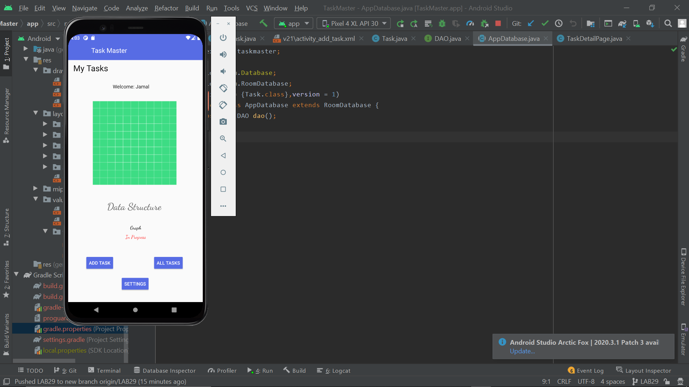
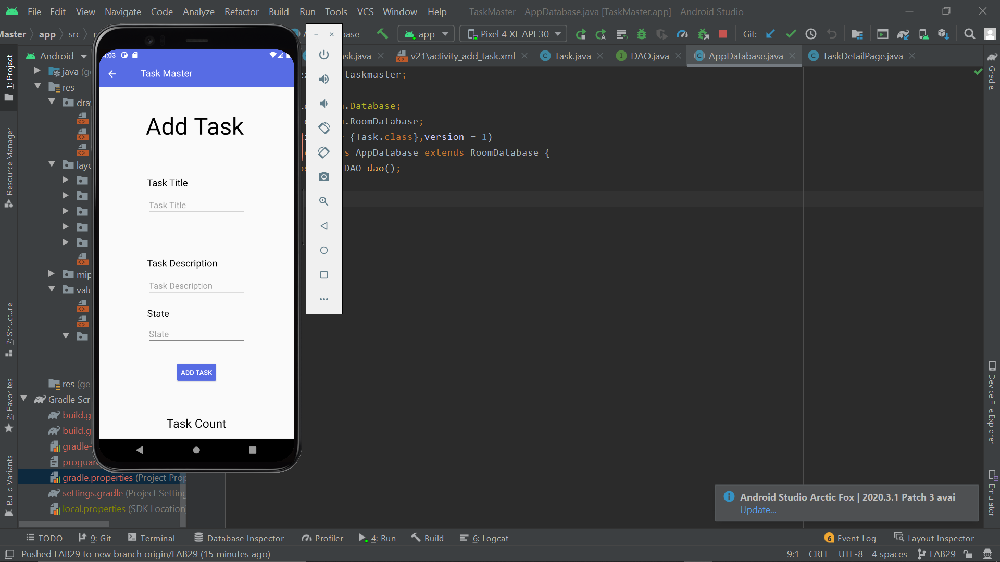

# TaskMaster
## Description:
To build an application that allows the user to navigate through his tasks and show each task that he/she clicked on.
Also allow the user to enter his/her username and view it in the home page and user can add his/her tasks to and can view them in the home page.
Also we added a feature that allows the user to store their tasks in a database.

## Lab26: Screenshots

